# Frank Perez

## **EJERCICIO 1:**

### 1.1 – Crea un directorio llamado repo01 en local (desde tu máquina) e ejecuta el comando pertinente para que dicho directorio para que se transforme el repositorio en local ¿Cómo podemos identificar que el repositorio se ha inicializado?

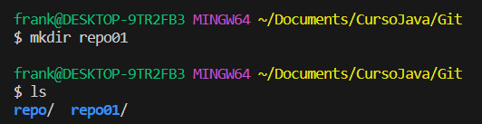
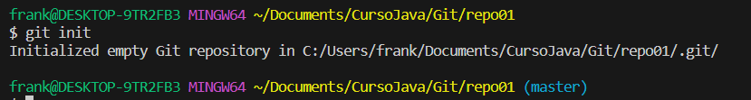

### 1.2 – Añade un documento llamado readme.md dentro del repositorio (recuerda que MD es la extensión de los ficheros Markdown) y documenta en su interior todos los pasos que vas realizando para crear un repositorio, etc. Puedes añadir fotos o lo que creas conveniente

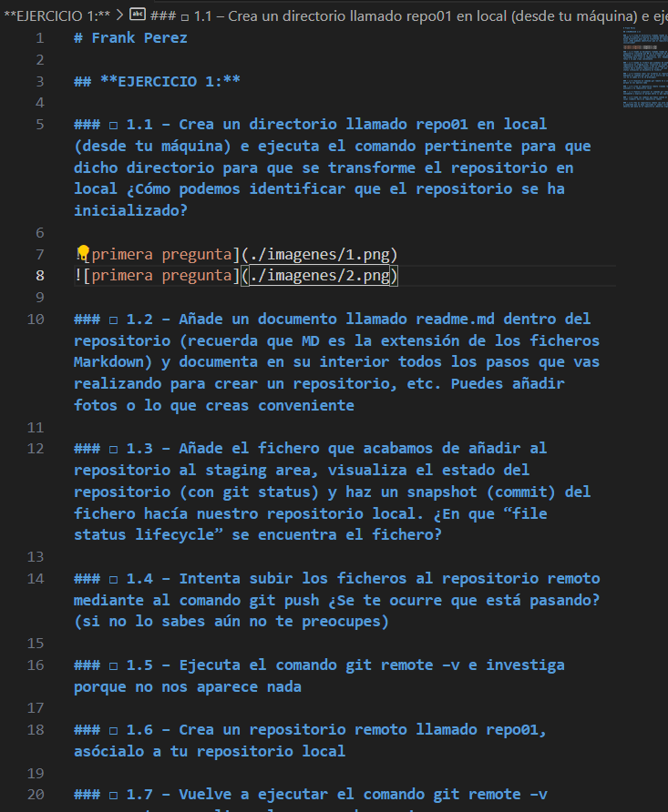
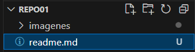

### 1.3 – Añade el fichero que acabamos de añadir al repositorio al staging area, visualiza el estado del repositorio (con git status) y haz un snapshot (commit) del fichero hacía nuestro repositorio local. ¿En que “file status lifecycle” se encuentra el fichero?

##### en el primer git status saldra untracked
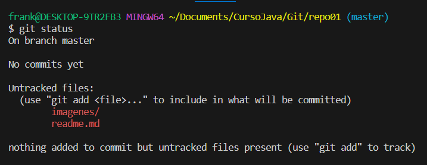
##### Despues haremos un git add . para agregar todos los archivos que estan untracked y despues haremos un git status otra vez y salndran en verde y commited.
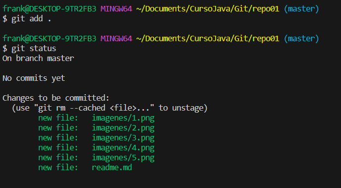
##### Hago un git commit escribiendo lo que he hecho.
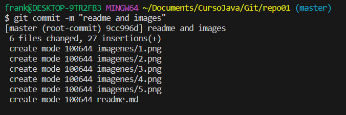

### 1.4 – Intenta subir los ficheros al repositorio remoto mediante al comando git push ¿Se te ocurre que está pasando? (si no lo sabes aún no te preocupes)

##### Lo que esta pasando es que no tenemos agregado un destino remoto en el cual subir los archivos.
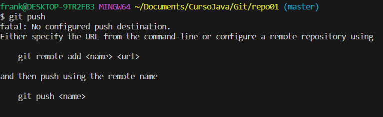

### 1.5 – Ejecuta el comando git remote –v e investiga porque no nos aparece nada

##### No aparece nada porque todavia no tenemos ningun remoto asociado.
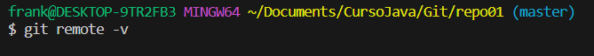

### 1.6 – Crea un repositorio remoto llamado repo01, asócialo a tu repositorio local

##### Aqui ya lo tendriamos creado
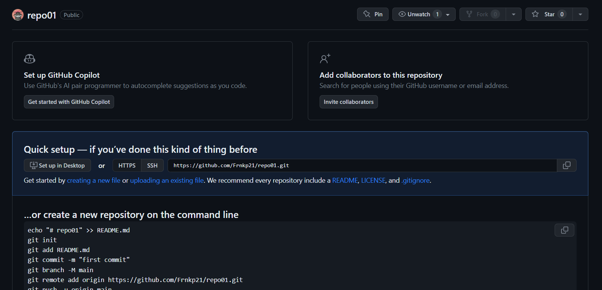
##### Usaremos estos 3 comandos para vincular el remoto con el local.
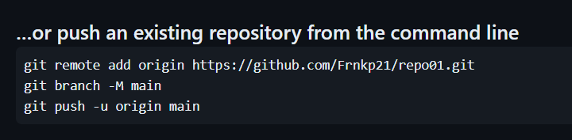

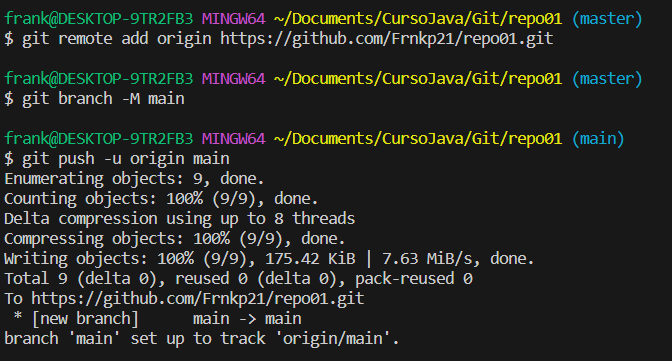

### 1.7 – Vuelve a ejecutar el comando git remote –v nuevamente y explica el porque ahora si que aparece

##### Despues de haber hecho los pasos anteriores ahora si nos saldra la ruta que hemos agregado.
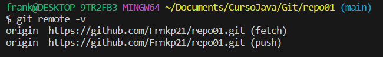

### 1.8 – Sube los cambios que hemos subido al snapshot local (commit) hacía al repositorio remoto

##### primero un git add y git commit con los nuevos cambios.
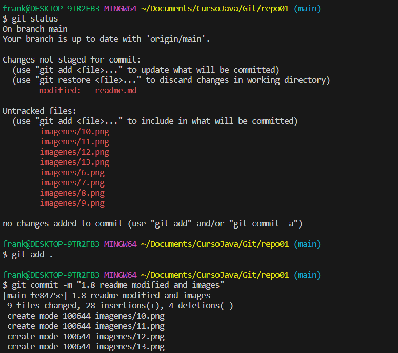
##### hacemos un git push y ya se subirian.
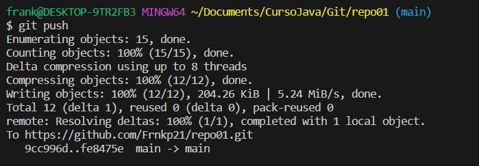

### 1.9 – Ves al repositorio remoto (en este caso GitHub) y comprueba que se haya realizado el commit correctamente y observa que pasa en el repositorio ¿Observas algo peculiar?

##### Se ve la informacion de el commit que hemos hecho como el tiempo que ha pasado desde que lo hicimos y el texto que le hemos puesto al commit los commits que hemos hecho.
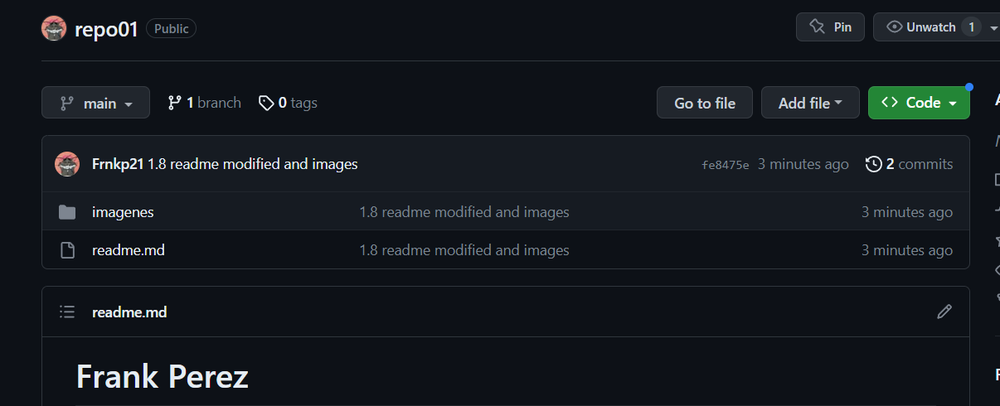

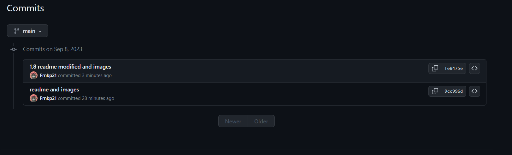